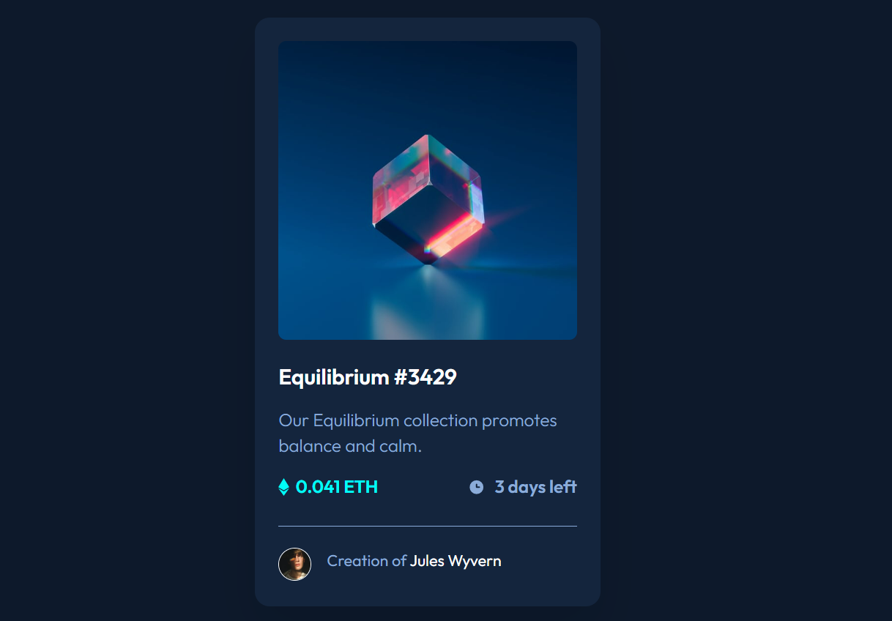

# Frontend Mentor - QR code component solution

## Overview

This is a solution to the [QR code component challenge on Frontend Mentor](https://www.frontendmentor.io/challenges/qr-code-component-iux_sIO_H).

### Screenshot

### Links

- Solution URL: [Solution URL here](https://github.com/NunuAbuashvili/NFT-Preview-Card-Component.git)
- Live Site URL: [Live site URL here](https://nunuabuashvili.github.io/NFT-Preview-Card-Component/)

### Built with

- Semantic HTML5 markup
- CSS custom properties

### What I learned

As this is my second project, I learned some of the most important tags and parts of HTML, also some basic operations with CSS.

### Continued development

In future projects I would like to fully understand the fundamentals and then, have a more in-depth look into what HTML and CSS can do.

### Useful resources

- [HTML Element Reference](https://www.w3schools.com/tags/ref_byfunc.asp) - All HTML elements in one place.
